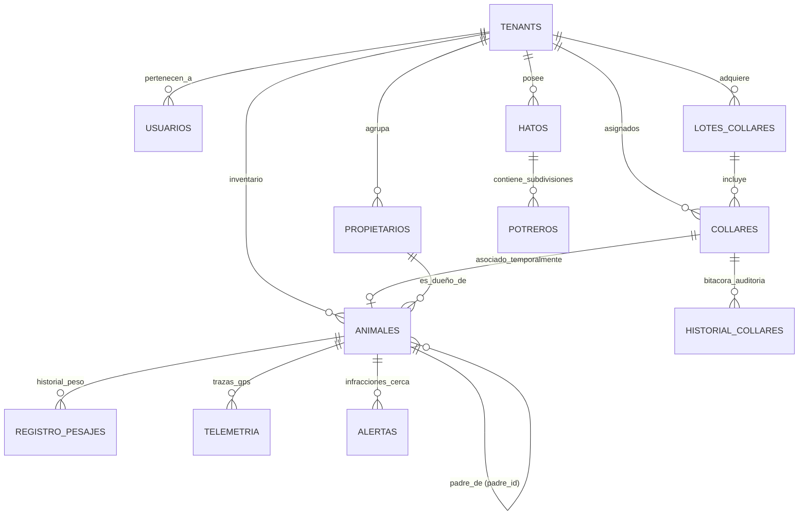

# 📖 Diccionario de Datos - Plataforma CowIA (2026)

Este documento detalla la estructura, las relaciones y el modelo conceptual de la base de datos relacional y geográfica de **CowIA** (*CowIA - Ganadería Inteligente, Cercas Virtuales y Analítica IA*). La plataforma opera sobre **PostgreSQL 15+** con la extensión espacial **PostGIS** bajo el sistema de referencia espacial **WGS 84 (SRID 4326)** para el procesamiento geográfico en tiempo real de cercas virtuales autónomas y telemetría de collares IoT.

---

## 🗺️ 1. Resumen de Áreas Funcionales y Tablas



El modelo de datos se divide en cinco (5) pilares:
1. **Multi-Tenancy & Seguridad SaaS**: `tenants`, `usuarios`.
2. **Infraestructura Espacial GIS**: `hatos` (perímetro general), `potreros` (rotación de pastoreo).
3. **Gestión de Hardware IoT & Ciclo de Vida**: `lotes_collares`, `collares`, `historial_collares`.
4. **Inventario Biológico & Zootecnia**: `animales`, `propietarios`, `historial_propietarios`.
5. **Métricas en Tiempo Real & Analítica**: `telemetria`, `alertas`, `registro_pesajes`, `parametros_rendimiento`.

---

## 🧭 2. Regla Fundamental de Arquitectura: Datos Estáticos vs. Dinámicos

> [!IMPORTANT]
> ### 🐮 ¿Por qué el Potrero NO se Asigna en el Registro de la Res?
> 
> * **El Animal es una Entidad Biológica**: Sus datos son inmutables o de evolución biológica (`arete_visual`, `raza`, `sexo`, `categoria`, `numero_hierro`, `fecha_nacimiento`, `madre_id`, `padre_id`, `propietario_id`).
> * **La Ubicación en Potrero es Dinámica y Derivada**:
>   1. La res se mueve físicamente por el campo.
>   2. El collar IoT transmite su coordenada GPS (`Point(lon, lat)`).
>   3. El motor PostGIS evalúa en tiempo real qué potrero contiene la coordenada mediante la función:
>      $$\text{ST\_Contains}(\text{potrero.perimetro}, \text{collar.ultima\_ubicacion})$$
>   4. La geocerca objetivo se sincroniza hacia el collar mediante MQTT (`POST /api/geocercas/sincronizar`).
> * **Conclusión**: El formulario de registro del animal **no debe solicitar el potrero**, ya que la pertenencia al potrero es un estado dinámico reportado por el collar y validado por el motor GIS.

---

## 🗂️ 3. Detalle Exhaustivo de Tablas

---

### 🏢 1. Tabla: `tenants` (Organizaciones / Fincas Adquirentes)
Aislamiento multi-empresa para el modelo SaaS de CowIA.

| Campo | Tipo de Dato | Restricciones | Descripción |
| :--- | :--- | :--- | :--- |
| `id` | `SERIAL` | `PRIMARY KEY` | Identificador único del tenant / cliente. |
| `nombre` | `VARCHAR(150)` | `NOT NULL` | Razón social o nombre de la hacienda/empresa. |
| `identificacion_fiscal` | `VARCHAR(50)` | `NOT NULL`, `UNIQUE` | RIF, RUT, CIF o NIT tributario. |
| `contacto_nombre` | `VARCHAR(100)` | `NULL` | Persona de contacto principal. |
| `telefono` | `VARCHAR(30)` | `NULL` | Teléfono corporativo. |
| `email` | `VARCHAR(100)` | `NOT NULL` | Correo electrónico de facturación / administración. |
| `direccion` | `TEXT` | `NULL` | Ubicación geográfica o domicilio fiscal. |
| `plan_suscripcion` | `VARCHAR(50)` | `DEFAULT 'PROFESSIONAL'` | Nivel de suscripción (`BASIC`, `PROFESSIONAL`, `ENTERPRISE`). |
| `limite_collares` | `INTEGER` | `DEFAULT 50` | Cantidad máxima de collares autorizados. |
| `limite_hatos` | `INTEGER` | `DEFAULT 3` | Cantidad máxima de hatos/fincas permitidas. |
| `permite_crear_potreros` | `BOOLEAN` | `DEFAULT TRUE` | Habilita el trazado de potreros de rotación. |
| `activo` | `BOOLEAN` | `DEFAULT TRUE` | Estado de la cuenta en la plataforma. |
| `creado_en` | `TIMESTAMP` | `DEFAULT CURRENT_TIMESTAMP` | Fecha de creación del tenant. |

---

### 👤 2. Tabla: `usuarios` (Control de Acceso y Roles)
Usuarios del sistema con credenciales cifradas y roles diferenciados.

| Campo | Tipo de Dato | Restricciones | Descripción |
| :--- | :--- | :--- | :--- |
| `id` | `SERIAL` | `PRIMARY KEY` | Identificador único del usuario. |
| `nombre` | `VARCHAR(100)` | `NOT NULL` | Nombre completo del usuario. |
| `email` | `VARCHAR(100)` | `NOT NULL`, `UNIQUE` | Correo electrónico para inicio de sesión. |
| `password_hash` | `VARCHAR(255)` | `NOT NULL` | Contraseña cifrada con algoritmo bcrypt. |
| `rol` | `VARCHAR(30)` | `DEFAULT 'OPERARIO_CAMPO'` | Rol: `SUPERADMIN`, `ADMIN_FINCA`, `OPERARIO_CAMPO`, `VETERINARIO`, `PROPIETARIO`. |
| `finca_asignada` | `VARCHAR(100)` | `NULL` | Nombre descriptivo de la finca donde opera. |
| `tenant_id` | `INTEGER` | `FK` references `tenants(id)` | Tenant al que pertenece el usuario (NULL para SUPERADMIN global). |
| `propietario_id` | `INTEGER` | `FK` references `propietarios(id)` | Vinculación si el usuario es un inversionista ganadero. |
| `activo` | `BOOLEAN` | `DEFAULT TRUE` | Permite suspender el acceso de usuarios. |
| `ultimo_ingreso` | `TIMESTAMP` | `NULL` | Fecha y hora del último login registrado. |
| `creado_en` | `TIMESTAMP` | `DEFAULT CURRENT_TIMESTAMP` | Fecha de alta del usuario. |

---

### 🤝 3. Tabla: `propietarios` (Dueños de Ganado)
Inversionistas o dueños del ganado para esquemas de pastoreo propio o en alquiler (talaje/medianería).

| Campo | Tipo de Dato | Restricciones | Descripción |
| :--- | :--- | :--- | :--- |
| `id` | `SERIAL` | `PRIMARY KEY` | Identificador único del propietario. |
| `nombre` | `VARCHAR(150)` | `NOT NULL` | Nombre completo o denominación comercial. |
| `documento_identidad` | `VARCHAR(30)` | `NOT NULL`, `UNIQUE` | Cédula, DNI, RIF o número de registro ganadero. |
| `telefono` | `VARCHAR(20)` | `NULL` | Teléfono de contacto. |
| `correo` | `VARCHAR(100)` | `NULL` | Correo de notificaciones de pesaje y alertas. |
| `creado_en` | `TIMESTAMP` | `DEFAULT CURRENT_TIMESTAMP` | Fecha de alta en el sistema. |

---

### 🌐 4. Tabla: `hatos` (Perímetros Generales de Fincas)
Límites exteriores de máxima prioridad de seguridad.

| Campo | Tipo de Dato | Restricciones | Descripción |
| :--- | :--- | :--- | :--- |
| `id` | `SERIAL` | `PRIMARY KEY` | Identificador único del hato. |
| `nombre` | `VARCHAR(100)` | `NOT NULL` | Nombre del hato o hacienda (ej: "Hato El Palmar"). |
| `perimetro` | `GEOMETRY(Polygon, 4326)` | `NOT NULL` | Polígono espacial PostGIS en WGS 84. |
| `tenant_id` | `INTEGER` | `FK` references `tenants(id)` | Organización propietaria de la tierra. |
| `creado_en` | `TIMESTAMP` | `DEFAULT CURRENT_TIMESTAMP` | Fecha de trazado del hato. |

---

### 🌾 5. Tabla: `potreros` (Subdivisiones de Pastoreo)
Potreros internos para rotación controlada y prevención de sobrepastoreo.

| Campo | Tipo de Dato | Restricciones | Descripción |
| :--- | :--- | :--- | :--- |
| `id` | `SERIAL` | `PRIMARY KEY` | Identificador único del potrero. |
| `hato_id` | `INTEGER` | `FK` references `hatos(id)` | Hato al que pertenece el potrero. |
| `nombre` | `VARCHAR(100)` | `NOT NULL` | Nombre del potrero (ej: "Potrero 1 - Guinea"). |
| `perimetro` | `GEOMETRY(Polygon, 4326)` | `NOT NULL` | Polígono espacial PostGIS del área de pastoreo. |
| `capacidad_max_cabezas` | `INTEGER` | `DEFAULT 50` | Carga animal máxima recomendada. |
| `margen_advertencia_metros` | `NUMERIC(5, 2)` | `DEFAULT 10.00` | Distancia perimetral en metros para alerta acústica de aviso. |
| `creado_en` | `TIMESTAMP` | `DEFAULT CURRENT_TIMESTAMP` | Fecha de creación del potrero. |

---

### 📦 6. Tabla: `lotes_collares` (Ingesta Masiva de Hardware)
Control de compras de lotes industriales de collares (ej. lote de 200 collares).

| Campo | Tipo de Dato | Restricciones | Descripción |
| :--- | :--- | :--- | :--- |
| `id` | `SERIAL` | `PRIMARY KEY` | Identificador único del lote. |
| `codigo_lote` | `VARCHAR(50)` | `NOT NULL`, `UNIQUE` | Código del lote (ej: "LOT-COW-2026-001"). |
| `proveedor` | `VARCHAR(100)` | `NOT NULL` | Fabricante o laboratorio de hardware. |
| `fecha_recepcion` | `DATE` | `NOT NULL` | Fecha de entrada al almacén central. |
| `cantidad_total` | `INTEGER` | `NOT NULL` | Total de unidades recibidas en el lote. |
| `version_hardware` | `VARCHAR(30)` | `DEFAULT 'HW-v2.1'` | Versión de placa electrónica / PCB. |
| `version_firmware_inicial` | `VARCHAR(30)` | `DEFAULT '1.0.0'` | Versión de firmware flasheada de fábrica. |
| `tenant_id` | `INTEGER` | `FK` references `tenants(id)` | Adquirente inicial (NULL = Stock Almacén Central CowIA). |
| `notas` | `TEXT` | `NULL` | Observaciones técnicas o logísticas de la importación. |
| `creado_en` | `TIMESTAMP` | `DEFAULT CURRENT_TIMESTAMP` | Fecha de registro del lote. |

---

### 📡 7. Tabla: `collares` (Hardware IoT & Telemetría Viva)
Dispositivos IoT físicos con módem celular y receptor GNSS.

| Campo | Tipo de Dato | Restricciones | Descripción |
| :--- | :--- | :--- | :--- |
| `id` | `VARCHAR(50)` | `PRIMARY KEY` | Identificador del collar (ej: "COW-2026-0001"). |
| `numero_sim` | `VARCHAR(20)` | `NOT NULL`, `UNIQUE` | Número de la línea celular SIM Card (telemetría GPRS/LTE). |
| `imei` | `VARCHAR(20)` | `NULL`, `UNIQUE` | Identificador único del módem celular. |
| `numero_serie` | `VARCHAR(50)` | `NULL` | Serial grabado en carcasa hermética. |
| `mac_address` | `VARCHAR(30)` | `NULL` | Dirección física MAC BLE / Wi-Fi del SoC. |
| `lote_id` | `INTEGER` | `FK` references `lotes_collares(id)` | Lote de procedencia. |
| `estado` | `VARCHAR(30)` | `DEFAULT 'EN_ALMACEN'` | `EN_ALMACEN`, `ACTIVO`, `DESACTIVADO`, `EN_REVISION`, `EN_TRANSITO`, `DE_BAJA`. |
| `ubicacion_almacen` | `VARCHAR(100)` | `NULL` | Bodega física donde reposa el dispositivo cuando no está en campo. |
| `motivo_estado` | `TEXT` | `NULL` | Justificación técnica del estado actual. |
| `tenant_id` | `INTEGER` | `FK` references `tenants(id)` | Finca/Cliente al que está dotado el dispositivo. |
| `nivel_bateria` | `INTEGER` | `CHECK (0-100)` | Porcentaje actual de batería reportado por MQTT. |
| `senal_celular` | `INTEGER` | `CHECK (0-5)` | Calidad de señal celular reportada (0 a 5). |
| `ultima_ubicacion` | `GEOMETRY(Point, 4326)` | `NULL` | Última coordenada GPS reportada en vivo. |
| `ultima_conexion` | `TIMESTAMP` | `NULL` | Fecha y hora del último paquete recibido vía MQTT. |
| `fecha_instalacion` | `DATE` | `NOT NULL` | Fecha de puesta en marcha original. |
| `version_firmware` | `VARCHAR(30)` | `DEFAULT '1.0.0'` | Versión actual del firmware FreeRTOS en ejecución. |
| `activo` | `BOOLEAN` | `DEFAULT TRUE` | Habilitación lógica del collar en el sistema. |
| `creado_en` | `TIMESTAMP` | `DEFAULT CURRENT_TIMESTAMP` | Fecha de alta en el sistema. |

---

### 📜 8. Tabla: `historial_collares` (Auditoría Inmutable de Hardware)
Bitácora de movimientos y trazabilidad del hardware.

| Campo | Tipo de Dato | Restricciones | Descripción |
| :--- | :--- | :--- | :--- |
| `id` | `SERIAL` | `PRIMARY KEY` | Identificador del evento de auditoría. |
| `collar_id` | `VARCHAR(50)` | `FK` references `collares(id)` | Collar involucrado. |
| `estado_anterior` | `VARCHAR(30)` | `NULL` | Estado previo del ciclo de vida. |
| `estado_nuevo` | `VARCHAR(30)` | `NOT NULL` | Nuevo estado asignado. |
| `tenant_id_anterior` | `INTEGER` | `NULL` | Finca anterior (si fue transferido). |
| `tenant_id_nuevo` | `INTEGER` | `NULL` | Nueva finca de destino. |
| `animal_id_anterior` | `INTEGER` | `NULL` | Res previa a la que estuvo vinculado. |
| `animal_id_nuevo` | `INTEGER` | `NULL` | Nueva res asignada. |
| `usuario_id` | `INTEGER` | `NULL` | Usuario responsable del movimiento. |
| `motivo` | `TEXT` | `NULL` | Justificación técnica u operativa. |
| `fecha_cambio` | `TIMESTAMP` | `DEFAULT CURRENT_TIMESTAMP` | Marca temporal exacta de la transacción. |

---

### 🐂 9. Tabla: `animales` (Inventario Biológico & Genealogía)
Ficha zootécnica permanente de la res.

| Campo | Tipo de Dato | Restricciones | Descripción |
| :--- | :--- | :--- | :--- |
| `id` | `SERIAL` | `PRIMARY KEY` | Identificador único del animal. |
| `arete_visual` | `VARCHAR(20)` | `NOT NULL`, `UNIQUE` | Arete visual / caravana en la oreja (ej: "BR-405"). |
| `numero_hierro` | `VARCHAR(50)` | `NULL` | Marca de hierro / fierro en la piel. |
| `raza` | `VARCHAR(50)` | `NULL` | Raza zootécnica (Brahman, Nelore, Angus, etc.). |
| `categoria` | `VARCHAR(30)` | `CHECK` | `Toro`, `Vaca`, `Novillo`, `Ternero`, `Vaquillona`. |
| `sexo` | `VARCHAR(10)` | `CHECK` | `Macho`, `Hembra`. |
| `fecha_nacimiento` | `DATE` | `NOT NULL` | Fecha de nacimiento para cálculo dinámico de edad. |
| `madre_id` | `INTEGER` | `FK` references `animales(id)` | **Madre biológica** (vínculo Animal ➔ Animal). |
| `padre_id` | `INTEGER` | `FK` references `animales(id)` | **Padre biológico** (vínculo Animal ➔ Animal). |
| `propietario_id` | `INTEGER` | `FK` references `propietarios(id)` | Dueño actual del animal. |
| `collar_id` | `VARCHAR(50)` | `UNIQUE`, `FK` references `collares(id)` | **Collar IoT vinculado temporalmente** (opcional, rotativo). |
| `tenant_id` | `INTEGER` | `FK` references `tenants(id)` | Finca donde reside el animal. |
| `foto_url` | `TEXT` | `NULL` | Fotografía de identificación zootécnica. |
| `creado_en` | `TIMESTAMP` | `DEFAULT CURRENT_TIMESTAMP` | Fecha de registro biológico. |

---

### ⚖️ 10. Tabla: `registro_pesajes` (Historial de Pesaje y GDP)

| Campo | Tipo de Dato | Restricciones | Descripción |
| :--- | :--- | :--- | :--- |
| `id` | `SERIAL` | `PRIMARY KEY` | Identificador único del pesaje. |
| `animal_id` | `INTEGER` | `FK` references `animales(id)` | Animal pesado. |
| `peso` | `NUMERIC(6, 2)` | `NOT NULL` | Peso registrado en báscula en kilogramos (kg). |
| `fecha_pesaje` | `DATE` | `DEFAULT CURRENT_DATE` | Fecha física de la pesada en corral. |
| `creado_en` | `TIMESTAMP` | `DEFAULT CURRENT_TIMESTAMP` | Fecha de registro en el software. |

---

### 🛰️ 11. Tabla: `telemetria` (Trazas Históricas GPS)

| Campo | Tipo de Dato | Restricciones | Descripción |
| :--- | :--- | :--- | :--- |
| `id` | `BIGSERIAL` | `PRIMARY KEY` | Identificador de la trama telemétrica. |
| `animal_id` | `INTEGER` | `FK` references `animales(id)` | Animal emisor. |
| `ubicacion` | `GEOMETRY(Point, 4326)` | `NOT NULL` | Coordenada GPS registrada. |
| `bateria` | `INTEGER` | `NOT NULL` | Nivel de batería al momento del reporte. |
| `senal` | `INTEGER` | `NOT NULL` | Nivel de señal celular (0-5). |
| `fecha_hora` | `TIMESTAMP` | `DEFAULT CURRENT_TIMESTAMP` | Timestamp del evento. |

---

### 🚨 12. Tabla: `alertas` (Infracciones de Geocerca y Salud)

| Campo | Tipo de Dato | Restricciones | Descripción |
| :--- | :--- | :--- | :--- |
| `id` | `SERIAL` | `PRIMARY KEY` | Identificador único de la alerta. |
| `animal_id` | `INTEGER` | `FK` references `animales(id)` | Animal infractor. |
| `tipo` | `VARCHAR(30)` | `CHECK` | `ESCAPE_HATO`, `INFRACCION_ROTACION`, `BATERIA_BAJA`. |
| `estado` | `VARCHAR(20)` | `DEFAULT 'ACTIVO'` | `ACTIVO`, `RESUELTO`. |
| `coordenada_evento` | `GEOMETRY(Point, 4326)` | `NULL` | Coordenada geográfica exacta del escape. |
| `fecha_inicio` | `TIMESTAMP` | `DEFAULT CURRENT_TIMESTAMP` | Momento de inicio de la infracción. |
| `fecha_fin` | `TIMESTAMP` | `NULL` | Momento de retorno o resolución del evento. |

---

### 📊 13. Tabla: `parametros_rendimiento` (Estándares Zootécnicos)

| Campo | Tipo de Dato | Restricciones | Descripción |
| :--- | :--- | :--- | :--- |
| `id` | `SERIAL` | `PRIMARY KEY` | Identificador de la norma zootécnica. |
| `raza` | `VARCHAR(50)` | `NOT NULL` | Raza evaluada. |
| `categoria` | `VARCHAR(30)` | `NOT NULL` | Categoría (Novillo, Vaca, etc.). |
| `gdp_promedio` | `NUMERIC(4, 3)` | `NOT NULL` | Ganancia Diaria de Peso esperada (kg/día). |
| `peso_adulto_esperado` | `NUMERIC(6, 2)` | `NOT NULL` | Peso de faena o madurez en kg. |
| `costo_diario_manutencion` | `NUMERIC(6, 2)` | `NOT NULL` | Costo diario de pasto, sal y manejo en $. |
| `precio_mercado_por_kg` | `NUMERIC(6, 2)` | `NOT NULL` | Precio de mercado actual por kg en pie. |

---

### 💉 14. Tabla: `catalogo_medicamentos` (Farmacia y Biológicos)

| Campo | Tipo de Dato | Restricciones | Descripción |
| :--- | :--- | :--- | :--- |
| `id` | `SERIAL` | `PRIMARY KEY` | Identificador único del medicamento. |
| `nombre` | `VARCHAR(100)` | `NOT NULL` | Nombre comercial (ej. "Aftogan - Vacuna Aftosa Bivalente"). |
| `tipo` | `VARCHAR(50)` | `CHECK` | `VACUNA`, `DESPARASITANTE`, `VITAMINA`, `ANTIBIOTICO`, `SUPLEMENTO`, `OTRO`. |
| `dosis_recomendada` | `VARCHAR(50)` | `NULL` | Dosis sugerida (ej. "2 ml Subcutánea"). |
| `periodo_revacunacion_dias` | `INTEGER` | `DEFAULT 180` | Frecuencia en días para la revacunación periódica. |
| `costo_unitario_estimado` | `NUMERIC(8, 2)` | `DEFAULT 0.00` | Costo unitario en $ por dosis. |
| `laboratorio` | `VARCHAR(100)` | `NULL` | Laboratorio farmacéutico fabricante. |
| `tenant_id` | `INTEGER` | `FK` references `tenants(id)` | Finca dueña del producto (`NULL` = Catálogo Global). |

---

### 🩺 15. Tabla: `eventos_sanitarios` (Aplicaciones Médicas y Vacunas)

| Campo | Tipo de Dato | Restricciones | Descripción |
| :--- | :--- | :--- | :--- |
| `id` | `SERIAL` | `PRIMARY KEY` | Identificador de la aplicación médica. |
| `animal_id` | `INTEGER` | `FK` references `animales(id)` | Res tratada. |
| `medicamento_id` | `INTEGER` | `FK` references `catalogo_medicamentos(id)` | Producto aplicado. |
| `fecha_aplicacion` | `DATE` | `DEFAULT CURRENT_DATE` | Fecha de administración. |
| `fecha_proxima_dosis` | `DATE` | `NULL` | **Fecha calculada automáticamente de revacunación**. |
| `dosis_aplicada` | `VARCHAR(50)` | `NULL` | Cantidad/vía suministrada. |
| `lote_medicamento` | `VARCHAR(50)` | `NULL` | Número de lote para trazabilidad sanitaria. |
| `veterinario_responsable` | `VARCHAR(100)` | `NULL` | Profesional a cargo. |
| `costo_aplicado` | `NUMERIC(8, 2)` | `DEFAULT 0.00` | Costo real cargado al animal. |
| `tenant_id` | `INTEGER` | `FK` references `tenants(id)` | Finca donde ocurrió el evento. |

---

### 🧬 16. Tabla: `servicios_reproductivos` (Montas & Inseminaciones)

| Campo | Tipo de Dato | Restricciones | Descripción |
| :--- | :--- | :--- | :--- |
| `id` | `SERIAL` | `PRIMARY KEY` | Identificador único del servicio. |
| `vaca_id` | `INTEGER` | `FK` references `animales(id)` | Hembra servida. |
| `toro_id` | `INTEGER` | `FK` references `animales(id)` | Macho reproductor (Monta Natural). |
| `tipo_servicio` | `VARCHAR(35)` | `CHECK` | `MONTA_NATURAL`, `INSEMINACION_ARTIFICIAL`, `TRANSFERENCIA_EMBRION`. |
| `codigo_pajuela` | `VARCHAR(50)` | `NULL` | Identificador del semen congelado (IA). |
| `raza_toro_donante` | `VARCHAR(50)` | `NULL` | Raza del toro donante (IA). |
| `fecha_servicio` | `DATE` | `DEFAULT CURRENT_DATE` | Fecha de la monta o inseminación. |
| `estado` | `VARCHAR(30)` | `CHECK` | `PENDIENTE_PALPACION`, `PREÑADA_CONFIRMADA`, `VACIA`, `PARTO_REGISTRADO`, `ABORTADA`. |
| `inseminador_responsable` | `VARCHAR(100)` | `NULL` | Técnico inseminador. |

---

### 🤰 17. Tabla: `palpaciones_diagnosticos` (Diagnóstico de Gestación)

| Campo | Tipo de Dato | Restricciones | Descripción |
| :--- | :--- | :--- | :--- |
| `id` | `SERIAL` | `PRIMARY KEY` | Identificador de la palpación. |
| `servicio_id` | `INTEGER` | `FK` references `servicios_reproductivos(id)` | Servicio evaluado. |
| `vaca_id` | `INTEGER` | `FK` references `animales(id)` | Vaca examinada. |
| `fecha_palpacion` | `DATE` | `DEFAULT CURRENT_DATE` | Fecha del diagnóstico. |
| `resultado` | `VARCHAR(30)` | `CHECK` | `PREÑADA`, `VACIA`, `DUDOSA`. |
| `dias_gestacion_estimados` | `INTEGER` | `NULL` | Días calculados por tamaño fetal. |
| `fecha_estimada_parto` | `DATE` | `NULL` | **Fecha proyectada de parto (283 días promedio)**. |
| `metodo_diagnostico` | `VARCHAR(30)` | `CHECK` | `PALPACION_RECTAL`, `ECOGRAFIA`, `OBSERVACION_CELO`. |
| `veterinario_palpador` | `VARCHAR(100)` | `NULL` | Médico veterinario examinador. |

---

### 🍼 18. Tabla: `partos_nacimientos` (Maternidad y Crías)

| Campo | Tipo de Dato | Restricciones | Descripción |
| :--- | :--- | :--- | :--- |
| `id` | `SERIAL` | `PRIMARY KEY` | Identificador del parto. |
| `servicio_id` | `INTEGER` | `FK` references `servicios_reproductivos(id)` | Servicio reproductivo origen. |
| `vaca_id` | `INTEGER` | `FK` references `animales(id)` | Madre que parió. |
| `fecha_parto` | `DATE` | `DEFAULT CURRENT_DATE` | Fecha de nacimiento. |
| `tipo_parto` | `VARCHAR(30)` | `CHECK` | `NORMAL`, `DISTOCICO_ASISTIDO`, `CESAREA`, `ABORTO`. |
| `condicion_cria` | `VARCHAR(30)` | `CHECK` | `VIVA`, `MUERTA`, `MELLIZOS_VIVOS`. |
| `cria_animal_id` | `INTEGER` | `FK` references `animales(id)` | **ID de la nueva res creada en el inventario biológico**. |
| `arete_cria` | `VARCHAR(20)` | `NULL` | Arete visual asignado a la cría. |
| `sexo_cria` | `VARCHAR(10)` | `NULL` | `Macho`, `Hembra`. |
| `peso_nacimiento` | `NUMERIC(5, 2)` | `NULL` | Peso inicial al nacer en kg. |

---

### 🔔 19. Tabla: `configuracion_notificaciones` (Reglas y Pasarelas de Alerta)

| Campo | Tipo de Dato | Restricciones | Descripción |
| :--- | :--- | :--- | :--- |
| `id` | `SERIAL` | `PRIMARY KEY` | Identificador único de configuración. |
| `tenant_id` | `INTEGER` | `UNIQUE`, `FK` references `tenants(id)` | Finca o cliente adquirente. |
| `canal_telegram_activo` | `BOOLEAN` | `DEFAULT FALSE` | Habilitación de bot de Telegram. |
| `telegram_bot_token` | `VARCHAR(100)` | `NULL` | Token de autenticación de Telegram BotFather. |
| `telegram_chat_id` | `VARCHAR(50)` | `NULL` | ID del chat o grupo de recepción. |
| `canal_whatsapp_activo` | `BOOLEAN` | `DEFAULT FALSE` | Habilitación de pasarela WhatsApp. |
| `whatsapp_phone` | `VARCHAR(50)` | `NULL` | Teléfono internacional de destino. |
| `canal_email_activo` | `BOOLEAN` | `DEFAULT FALSE` | Habilitación de despachos por correo. |
| `email_destinatarios` | `TEXT` | `NULL` | Lista de emails separados por coma. |
| `alerta_escape_geocerca` | `BOOLEAN` | `DEFAULT TRUE` | Disparo ante escape perimetral. |
| `alerta_bateria_critica` | `BOOLEAN` | `DEFAULT TRUE` | Disparo ante batería < 20%. |
| `alerta_collar_offline` | `BOOLEAN` | `DEFAULT TRUE` | Disparo si collar pasa > 4h sin reporte. |
| `alerta_celo_detectado` | `BOOLEAN` | `DEFAULT TRUE` | Disparo ante detección de celo/estro. |

---

### 📜 20. Tabla: `bitacora_notificaciones` (Auditoría de Envíos)

| Campo | Tipo de Dato | Restricciones | Descripción |
| :--- | :--- | :--- | :--- |
| `id` | `SERIAL` | `PRIMARY KEY` | Identificador del despacho. |
| `alerta_id` | `INTEGER` | `FK` references `alertas(id)` | Alerta asociada (si aplica). |
| `canal` | `VARCHAR(30)` | `CHECK` | `TELEGRAM`, `WHATSAPP`, `EMAIL`, `WEB_PUSH`. |
| `destinatario` | `VARCHAR(100)` | `NOT NULL` | Teléfono, chat_id o correo de recepción. |
| `titulo` | `VARCHAR(150)` | `NULL` | Título del mensaje. |
| `mensaje` | `TEXT` | `NOT NULL` | Cuerpo del mensaje despachado. |
| `estado` | `VARCHAR(20)` | `CHECK` | `ENVIADO`, `FALLIDO`, `PENDIENTE`. |
| `detalles_respuesta` | `TEXT` | `NULL` | Log de respuesta del proveedor/API. |
| `tenant_id` | `INTEGER` | `FK` references `tenants(id)` | Finca emisora. |

---

### 🌡️ 21. Tabla: `metricas_actividad_rumia` (Sensor Inercial IMU MPU-6050)

| Campo | Tipo de Dato | Restricciones | Descripción |
| :--- | :--- | :--- | :--- |
| `id` | `BIGSERIAL` | `PRIMARY KEY` | Identificador de la muestra horaria. |
| `animal_id` | `INTEGER` | `FK` references `animales(id)` | Res evaluada. |
| `collar_id` | `VARCHAR(50)` | `FK` references `collares(id)` | Dispositivo inercial emisor. |
| `fecha` | `DATE` | `DEFAULT CURRENT_DATE` | Día de registro. |
| `hora_bloque` | `INTEGER` | `CHECK (0-23)` | Bloque horario del día (0 a 23). |
| `minutos_pastoreo` | `INTEGER` | `DEFAULT 0` | Minutos de pastoreo activo en la hora. |
| `minutos_rumia` | `INTEGER` | `DEFAULT 0` | Minutos de masticación / rumia en la hora. |
| `minutos_descanso` | `INTEGER` | `DEFAULT 0` | Minutos de descanso o sueño. |
| `minutos_caminata` | `INTEGER` | `DEFAULT 0` | Minutos de desplazamiento / caminata. |
| `indice_actividad_promedio` | `NUMERIC(4, 2)` | `DEFAULT 1.00` | Vector de aceleración resultante (G-Force). |
| `alerta_celo` | `BOOLEAN` | `DEFAULT FALSE` | Indicador de hiperactividad nocturna. |
| `alerta_letargo` | `BOOLEAN` | `DEFAULT FALSE` | Indicador de timpanismo / fiebre. |

---

## ⚡ 4. Índices Espaciales y de Rendimiento

```sql
-- Índices Espaciales (GIST)
CREATE INDEX idx_hatos_perimetro ON hatos USING GIST (perimetro);
CREATE INDEX idx_potreros_perimetro ON potreros USING GIST (perimetro);
CREATE INDEX idx_telemetria_ubicacion ON telemetria USING GIST (ubicacion);
CREATE INDEX idx_collares_ultima_ubicacion ON collares USING GIST (ultima_ubicacion);

-- Índices Relacionales (B-Tree)
CREATE INDEX idx_animales_collar ON animales (collar_id);
CREATE INDEX idx_animales_tenant ON animales (tenant_id);
CREATE INDEX idx_animales_propietario ON animales (propietario_id);
CREATE INDEX idx_animales_madre ON animales (madre_id);
CREATE INDEX idx_animales_padre ON animales (padre_id);
CREATE INDEX idx_collares_tenant ON collares (tenant_id);
CREATE INDEX idx_collares_lote ON collares (lote_id);
CREATE INDEX idx_telemetria_animal_fecha ON telemetria (animal_id, fecha_hora DESC);
CREATE INDEX idx_alertas_estado_tipo ON alertas (estado, tipo);
CREATE INDEX idx_eventos_sanitarios_animal ON eventos_sanitarios (animal_id);
CREATE INDEX idx_eventos_sanitarios_proxima_dosis ON eventos_sanitarios (fecha_proxima_dosis);
CREATE INDEX idx_servicios_vaca ON servicios_reproductivos (vaca_id);
CREATE INDEX idx_palpaciones_parto_estimado ON palpaciones_diagnosticos (fecha_estimada_parto);
CREATE INDEX idx_bitacora_notif_tenant ON bitacora_notificaciones (tenant_id);
CREATE INDEX idx_salud_rumia_animal_fecha ON metricas_actividad_rumia (animal_id, fecha DESC);
```
