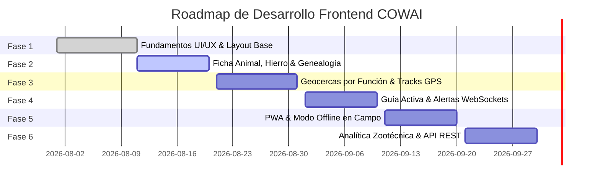

# Plan de Desarrollo Web Frontend por Fases - Plataforma COWAI

Este documento establece la hoja de ruta estratégica para el desarrollo del **Frontend Web de COWAI** (*Smart Livestock Fencing OS*), definiendo los objetivos, componentes y entregables técnicos de cada fase.

---

## 📌 Resumen del Roadmap Técnico

---

## 🚩 FASE 1: Fundamentos UI/UX, Design System y Estructura Base (COMPLETADA - MVP v1.0)

### 🎯 Objetivos:
- Definir el sistema de diseño **Dark Mode Glassmorphism** (Fondo `#090d16`, bordes translúcidos, tipografías *Outfit* e *Inter*).
- Desarrollar la arquitectura general en 3 secciones adaptables:
  1. **Sidebar de Control (Izquierda):** Pestañas de navegación e interacción.
  2. **Viewport del Mapa Satelital (Centro):** Cartografía interactiva con Leaflet.js y capas Esri/OSM.
  3. **Panel Telemétrico Live (Derecha):** Listado y estado en tiempo real de collares vinculados.
- Crear la barra superior **Header Bar COWAI** con branding, badges de estado IoT y botones de acceso rápido.

### 📦 Entregables:
- `frontend/index.html` con estructura semántica.
- `frontend/css/styles.css` con variables CSS globales.
- `frontend/js/mapManager.js` y `frontend/js/app.js` inicializados.

---

## 🚩 FASE 2: Ficha Técnica Animal, No. del Hierro, Genealogía y Escáner QR

### 🎯 Objetivos:
- **Ficha del Animal Enriquecida:** Campos para Arete/RFID, Nombre, Raza, Sexo, Fecha de Nacimiento, Foto y **No. del Hierro 🏷️** (Marca registrada de la ganadería).
- **Módulo de Genealogía Básica:** Componente visual para mostrar el árbol genético (Padre/Toro, Madre/Vaca, Línea genética).
- **Vinculación por Código QR / Barras:** Modal interactivo con cámara de escaneo y simulador para emparejar collares inteligentes en campo.
- **Filtros de Búsqueda:** Búsqueda reactiva por Arete, Nombre, No. de Hierro o Categoría.

### 📦 Entregables:
- Modal `modal-animal-profile` con visualización del árbol genealógico.
- Modal `modal-qr-scanner` con escáner e indicador visual.
- Eventos de búsqueda y selección en `js/app.js`.

---

## 🚩 FASE 3: Geocercas por Función, Estímulo Progresivo e Historial GPS (Tracks)

### 🎯 Objetivos:
- **Categorización de Geocercas por Función:**
  - 🥛 **Zona de Ordeño:** Perímetro de ordeño diario.
  - 🛑 **Zona de Cuarentena:** Área aislada para tratamiento veterinario.
  - 🌾 **Potrero en Descanso:** Pasturas en rotación de suelo.
  - 🛣️ **Callejuelas:** Corredores de paso entre potreros.
- **Estímulo Progresivo en Perímetro:**
  - 🟢 **Zona Segura:** Pastoreo libre.
  - 🔊 **Búfer de Advertencia (1-3m):** Sonido continuo emulado en collar.
  - ⚡ **Límite Físico:** Pulso eléctrico leve progresivo al borde del polígono.
- **Historial de Recorrido GPS (Tracks):** Selector conmutador de **24 Horas**, **7 Días** y **30 Días** para dibujar estelas de movimiento en el mapa.

### 📦 Entregables:
- Sistema de capas de geocercas clasificadas en `js/mapManager.js`.
- Indicador visual de estímulo progresivo.
- Capa de estelas históricas de GPS.

---

## 🚩 FASE 4: Pastoreo Remoto (Guía Activa) y Alertas WebSockets en Vivo

### 🎯 Objetivos:
- **Guía Activa (Arreo Remoto):**
  - Módulo de control para seleccionar potrero de origen y destino por función.
  - Botón `🚀 Iniciar Arreo Remoto Activo` que transmite ráfagas de tonos direccionales a los collares del hato.
  - Animación del desplazamiento de los marcadores hacia el potrero destino.
- **Alertas en Tiempo Real:**
  - Notificaciones emergentes ante escapes de zona segura con destellos rojos pulsantes.
  - Panel de registro de alertas históricas.

### 📦 Entregables:
- Módulo de Guía Activa en la barra lateral y Header.
- Manejador de eventos WebSockets `telemetria_realtime` para actualización continua.

---

## 🚩 FASE 5: PWA, Modo Offline en Campo y Experiencia Táctil Móvil

### 🎯 Objetivos:
- **PWA (Progressive Web App):** Configuración de `manifest.json` y `service-worker.js` para permitir la instalación de la app en smartphones Android/iOS.
- **Modo Offline (IndexedDB):** Capacidad de registrar animales, pesajes y códigos QR en zonas de potrero sin señal celular, sincronizando automáticamente al recuperar conexión.
- **Diseño Táctil Responsivo:** Paneles inferiores (Bottom Sheets) deslizables para dispositivos móviles de los vaqueros.

### 📦 Entregables:
- `manifest.json` e icono de app.
- `service-worker.js` para almacenamiento en caché de mapas y datos offline.

---

## 🚩 FASE 6: Dashboard Zootécnico Avanzado, Analítica y Reportes

### 🎯 Objetivos:
- Integración completa con la API REST y la base de datos PostGIS.
- Gráficos interactivos de proyección de peso, Ganancia Diaria de Peso (GDP) y punto óptimo de venta comercial con `Chart.js`.
- Exportación de reportes PDF/Excel para inventario de ganado y rotación de pasturas.

### 📦 Entregables:
- Dashboard estadístico completo e integración final de producción.
