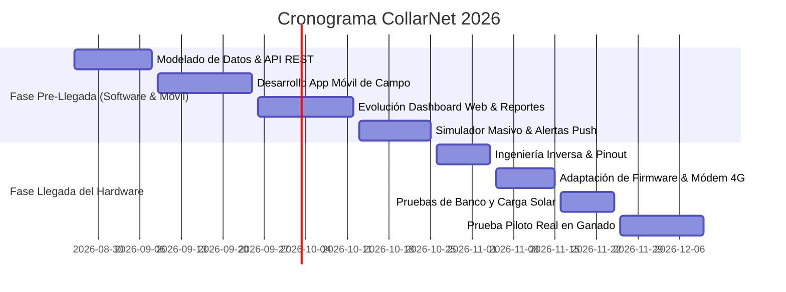

# 🗺️ Roadmap de Desarrollo: CollarNet (2026)

Cronograma estratégico y técnico para el desarrollo del ecosistema de software (Web & Móvil), modelado de datos, ingeniería inversa del dispositivo industrial y validación en campo.

---

## ⏱️ Línea de Tiempo General

---

## 📅 ETAPA 1: Antes de la Llegada del Dispositivo (26 de Agosto – 25 de Octubre de 2026)
*Objetivo: Tener la plataforma 100% terminada, probada y simulada para que el software no sea un cuello de botella.*

### 🔹 Sprint 1: Ampliación del Modelado de Datos y Backend
* **Fechas:** 26 de Agosto – 08 de Septiembre, 2026 (Semanas 1 y 2)
* **Entregables Clave:**
  * [x] **Módulo de Sanidad y Vacunación:** Tabla de historial médico, vacunas aplicadas, desparasitaciones y alertas de fechas de revacunación.
  * [x] **Módulo de Ciclos Reproductivos:** Registro de servicios/montas, diagnóstico de preñez, fechas estimadas de parto e historial de crías.
  * [x] **Gestión de Pasturas y Carga Animal:** Cálculo de UGM (Unidad Gran Ganado por hectárea), días de descanso del potrero y alertas de rotación preventiva.
  * [x] **API REST Extendida:** Endpoints documentados para consumo desde App Móvil y Web.

---

### 🔹 Sprint 2: Desarrollo de la App Móvil de Campo (Mobile-First / PWA)
* **Fechas:** 09 de Septiembre – 25 de Septiembre, 2026 (Semanas 3, 4 y 5)
* **Entregables Clave:**
  * [x] **Interfaz Rápida para Manga/Corral:** Formulario simplificado táctil para asociar arete visual con collar físico en 3 toques.
  * [x] **Lector de Código QR / Barras con Cámara:** Escaneo rápido del serial del collar o arete desde el teléfono.
  * [x] **Módulo de Pesaje Ágil:** Registro de peso en báscula con cálculo instantáneo de Ganancia Diaria de Peso (GDP).
  * [x] **Modo Offline & Sincronización Local:** Almacenamiento local (IndexedDB) para trabajar sin cobertura celular en el hato y sincronizar automáticamente al detectar Wi-Fi/4G.
  * [x] **Brújula de Rescate / Rastreo en Campo:** Función "Buscar Res" que muestra dirección y distancia en metros hacia el animal fugado usando el GPS del teléfono.

---

### 🔹 Sprint 3: Evolución del Dashboard Web y Analítica Avanzada
* **Fechas:** 26 de Septiembre – 12 de Octubre, 2026 (Semanas 6 y 7)
* **Entregables Clave:**
  * [x] **Visualizador del Árbol Genealógico:** Componente interactivo de pedigrí y líneas de consanguinidad.
  * [x] **Mapas de Calor (Heatmaps) de Pastoreo:** Visualización de áreas de mayor pisoteo/frecuentación para evitar sobrepastoreo.
  * [x] **Generador de Informes:** Exportación de fichas de animales, inventario ganadero y reportes de pesaje en PDF e informes en Excel.
  * [x] **Centro de Alertas Multicanal:** Integración de bot de notificaciones instantáneas (Telegram / WhatsApp / Email) ante escapes o eventos críticos.

---

### 🔹 Sprint 4: Simulador Masivo de Flota y Pruebas End-to-End
* **Fechas:** 13 de Octubre – 25 de Octubre, 2026 (Semanas 8 y 9)
* **Entregables Clave:**
  * [x] **Simulador Multi-Collar:** Script de carga simulando 50 a 100 collares enviando telemetría MQTT simultánea.
  * [x] **Pruebas de Estrés en Base de Datos:** Optimización de índices espaciales PostGIS ante tráfico continuo.
  * [x] **Certificación de la Plataforma Web & Móvil:** Validación cruzada de todos los flujos de usuario antes del arribo del paquete.

---

## 📦 ETAPA 2: Cuando Llegue el Dispositivo Físico (26 de Octubre – 15 de Diciembre de 2026)
*Objetivo: Ingeniería inversa del hardware, carga del firmware propio, validación de laboratorio y puesta en marcha en campo.*

### 🔹 Sprint 5: Recepción e Ingeniería Inversa del Hardware
* **Fechas:** 26 de Octubre – 04 de Noviembre, 2026 (Semana 10)
* **Acciones:**
  * Apertura cuidadosa de la carcasa hermética y registro fotográfico HD de la PCB.
  * Identificación de componentes principales (MCU/SoC, módem celular 4G, módulo GNSS, acelerómetro, controlador de carga solar).
  * Rastreo de pads de prueba/flasheo (`UART`, `SWD`, `BOOT`, `VCC`, `GND`).
  * Mapeo de pines GPIO (Buzzer, disparador MOSFET de pulso eléctrico, bus I2C, ADC de batería).

---

### 🔹 Sprint 6: Portabilidad del Firmware y Pruebas de Banco
* **Fechas:** 05 de Noviembre – 15 de Noviembre, 2026 (Semana 11)
* **Acciones:**
  * Adaptación del archivo `config.h` con el nuevo mapa de pines.
  * Configuración del módem celular 4G (APN local y conexión MQTT por red móvil).
  * Implementación de la rutina de estímulo progresivo (Tono de aviso -> Pulso eléctrico de bajo voltaje seguro con temporizador de protección).
  * Validación de transmisión MQTT desde el collar físico hacia el servidor en la nube.

---

### 🔹 Sprint 7: Pruebas de Autonomía y Banco de Carga Solar
* **Fechas:** 16 de Noviembre – 25 de Noviembre, 2026 (Semana 12)
* **Acciones:**
  * Medición de consumo en mA durante transmisión, escucha y modo reposo con acelerómetro.
  * Verificación de recarga solar con exposición directa al sol exterior.
  * Validación del algoritmo de geocerca en movimiento caminando en exteriores con el dispositivo en la mano.

---

### 🔹 Sprint 8: Prueba Piloto en Campo Real con Ganado
* **Fechas:** 26 de Noviembre – 10 de Diciembre, 2026 (Semanas 13 y 14)
* **Acciones:**
  * Colocación física del collar en reses seleccionadas en la manga.
  * Vinculación en vivo utilizando la **App Móvil de Campo** desarrollada.
  * Definición de potrero y verificación de las alertas de rotación y comportamiento del animal ante el estímulo auditivo/disuasivo.
  * Evaluación final de robustez de la sujeción mecánica y comportamiento del sistema.

---

## 📊 Resumen de Hitos y Fechas Clave

| Hito | Fecha Límite | Estado |
| :--- | :--- | :--- |
| **H1: Modelado de Datos y API Extendida** | 08-Sep-2026 | ⏳ Próximo a iniciar |
| **H2: App Móvil de Campo Operativa (PWA/Offline)** | 25-Sep-2026 | 🗓️ Planificado |
| **H3: Dashboard Web Completo + Reportes** | 12-Oct-2026 | 🗓️ Planificado |
| **H4: Plataforma Certificada con Simulador de Flota** | 25-Oct-2026 | 🗓️ Planificado |
| **H5: Arribo de Dispositivos e Ingeniería Inversa** | 04-Nov-2026 | 📦 En espera de envío |
| **H6: Firmware CollarNet flasheado en Collar Chino** | 15-Nov-2026 | 🛠️ Planificado |
| **H7: Prueba Piloto Certificada en Finca con Ganado** | 10-Dic-2026 | 🐂 Hito Final |
